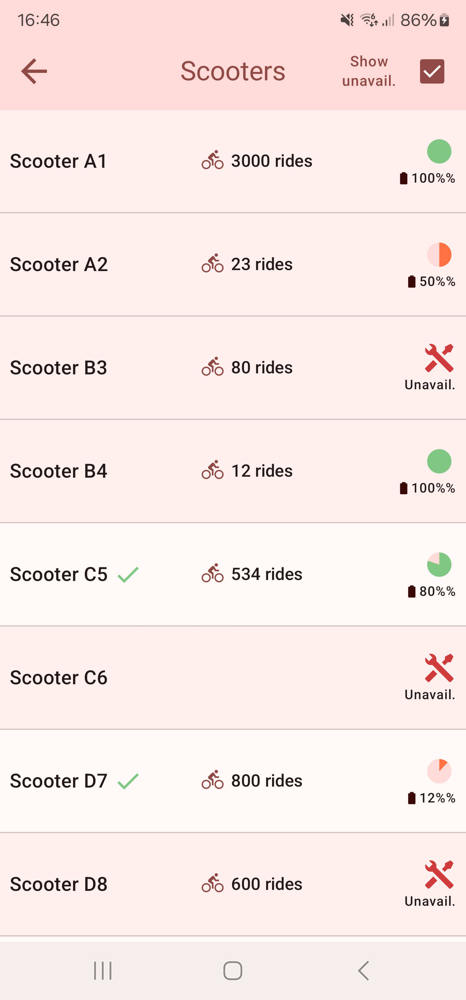
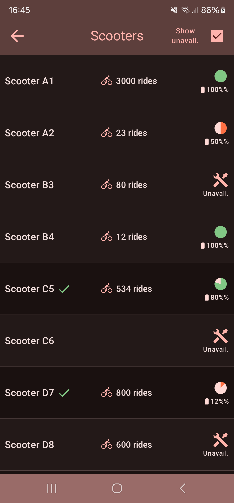

# Scooter Listing app example

An example app built as an example to showcase some architecture as well as some Compose functionality.
It is in no way meant to be an application for real world use.

## Some specifics
- MinSDK is 24, targetSDK is 34, JVM target is Jav17, [can be seen here](https://github.com/lenneryd/listing-app/blob/main/app/build.gradle.kts)
- Uses Compose for UI
- Uses ViewModels together with Compose to provide a presentation layer
- Uses UseCase and a Repository for data retrieval
- Does not use any local storage currently. See `ScooterRepository` class for rationale.
- Uses Dagger Hilt for Dependency Injection
- Uses Jetpack Compose Navigation for navigation between the screens
- Uses Material Design 3 with static colors, the colors have been generated using Material Design's color generator.
- Uses Square's Retrofit and Okhttp, together with Kotlinx.serialization for data layers.
- Uses Coroutine Flows accessed by ViewModels to provide a reactive presentation layer.
- Uses Robolectric for some test functionality.
- App supports dark-mode and light mode. 

- Does not use currently utilize any Espresso UI tests.

## Building
Repository should be possible to import as an Android Studio project. **Android Studio Ladybug | 2024.2.1** was used during development.
App can be built with `./gradlew clean assmbleDebug` or `./gradlew clean assembleRelease` or using Android Studio. 
Tests can be run through Android studio or by running `./gradlew clean :app:testDebugUnitTest`

# Known issues
- When running in darkmode the default crossfade animation of the Compose Navigation library is a little too intense when going between screens.
- Does not currently have support for rotation. App is locked into portrait. List screen works in landscape mode but Details screen would need some adjustments to work well in landscape.

# Gallery

